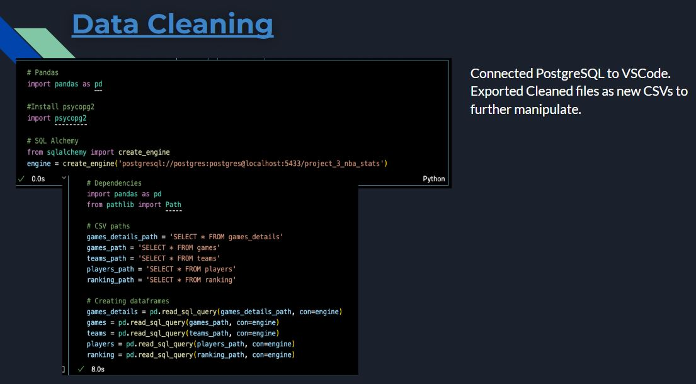
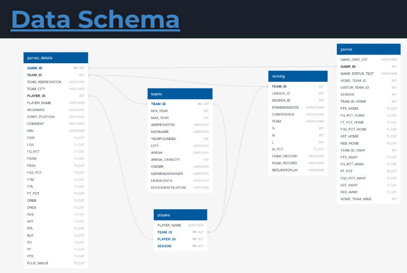
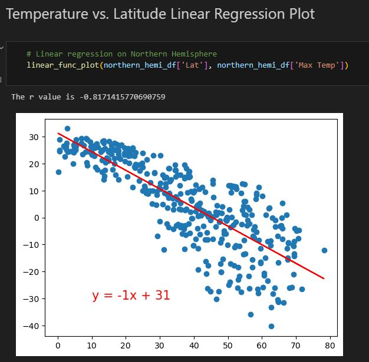
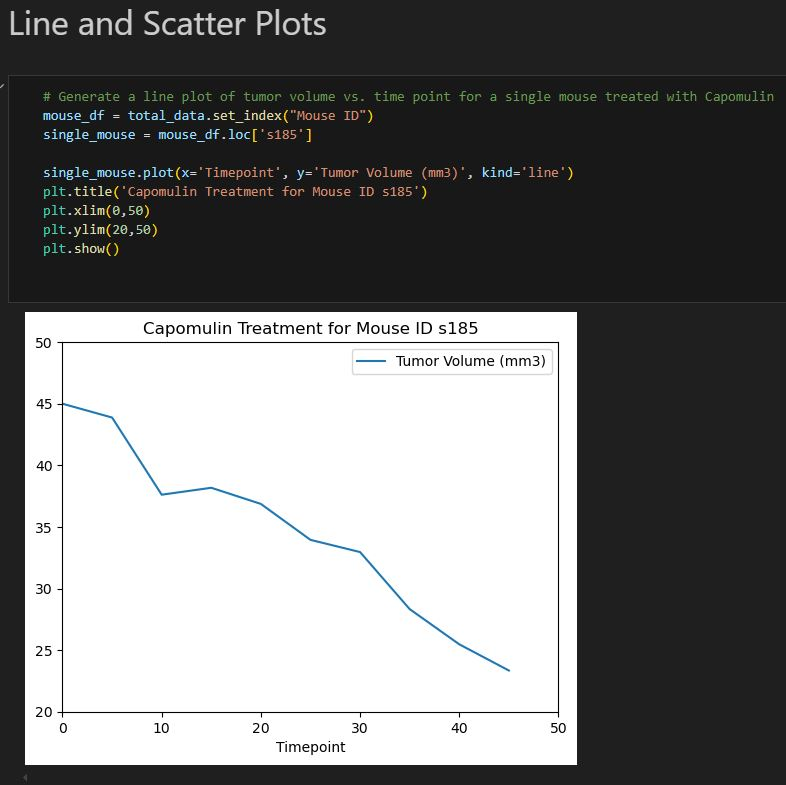
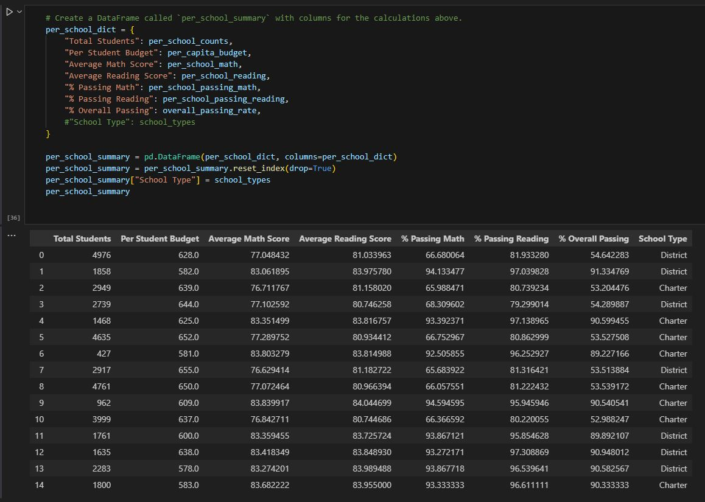
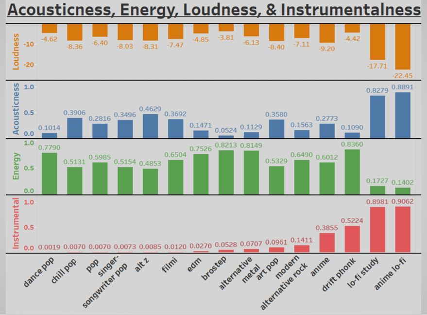

  <link rel="stylesheet" href="mainstyle.css">

<section id="headline">
<h3>&#8594 Results-Driven, Detail-Focused Data Analyst</h3>
  </section>

## About Me

### Seeking a valuable addition to your team? <a href="#contact">Contact me now!</a>

## Mission

### Turning complex data into actionable insights
> I am a results-driven data analyst with a strong foundation in mathematics and data analytics. My academic and professional experiences have equipped me with a diverse skill set in data management, cleanup, and visualization. I am committed to leveraging my analytical abilities and technical expertise to drive impactful, data-driven insights and solutions. I also bring strong project management and collaboration skills, having worked on projects that required close coordination with cross-functional teams. My analytical mindset is complemented by a high attention to detail and a commitment to accuracy, ensuring that data integrity is always maintained. I am dedicated to continuous learning to deliver solutions and contribute meaningfully to organizational growth.

## Projects
View Full Repositories: [GitHub](https://github.com/JerricaRaemer)
>
> Python Data Manipulation: Processed and transformed data by reading CSV files, manipulating datasets, and exporting results to text files for streamlined analysis.
>
> Data Visualization: Developed visual data dashboards using Python and Tableau to analyze key trends.
>
> Pandas Data Handling: Analyzed and organized data by efficiently sorting, grouping, and calculating key metrics such as percentages within data frames.
>
> SQL Database Management: Designed and modified database tables, executed inner joins, and organized data by grouping and ordering columns for efficient querying and analysis.
>

## Technical Skills
>
> Data Management: Data cleaning, ETL processes, database management using Python and SQL.
>
> Data Visualization: Python, Tableau, Excel.
>
> Project Management: GitHub, GitLab.
>
> Programming Languages: Python, C++.
>

## Portfolio

  

  

  

  

  

  

## Education
> Bachelor of Science, Mathematics, University of Oregon, Graduation: 2024
>
> Key Courses: Data Analysis, Linear Algebra, Discrete Math, Probability, Stochastic Processes.
>
> Technical Skills: Python, Pandas, Tableau, SQL, APIs, JavaScript, HTML, ETL Processes.

<a href="#headline">Back to top</a>

## Contact
> Let's chat: 425-829-0930
> 
> View my projects: [GitHub](https://github.com/JerricaRaemer)
> 
> Let’s connect: [LinkedIn](https://www.linkedin.com/in/jerrica-raemer/)
>
> Send me a project request: jraemer@outlook.com
>

<section id="contact">
  <h3>I'd love to hear from you!</h3>
  </section>
